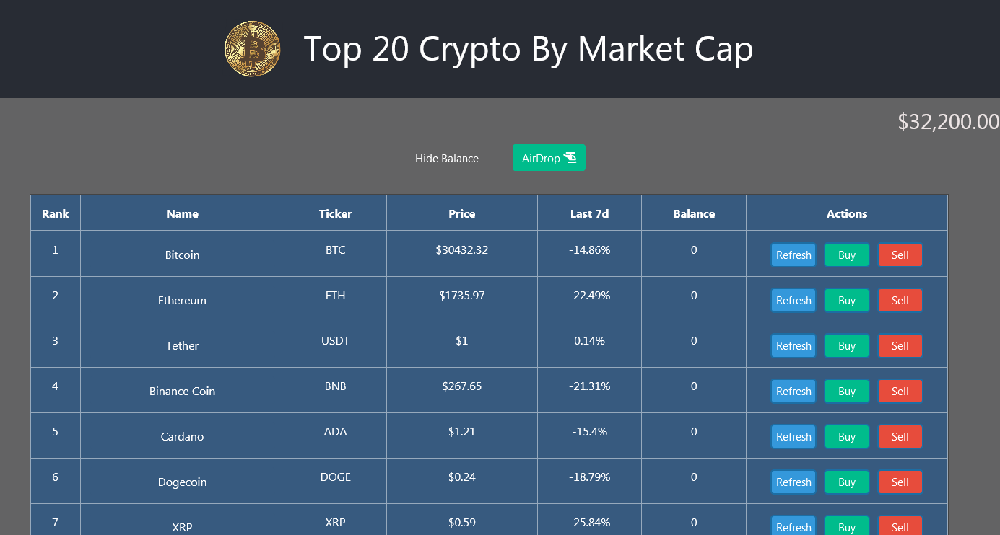

# Coin-Exchange - The 20 Biggest Cryptos By Market Cap

Web app built with React as part of the programming course: React Web Development 101 on [academy.ivanontech.com](https://academy.ivanontech.com/).

Live demo available here: [https://pedrojok01.github.io/coin-exchange/](https://pedrojok01.github.io/coin-exchange/)

## Installation

Make sure you have the following ready:
- `npm` installed
- Cloned the repo via `git clone`

## Deployment

To deploy the client, open your terminal, go to the COIN-EXCHANGE repo and type: `npm install`

## Use

You are now set to start your local server. Make sure you're still in the `COIN-EXCHANGE` repo and type:
 `npm start`

 ## Note

 This is a basic prototype with some basic functions. Feel free to use it, improve it, or report some issues!

If you like it, a donation is always welcome! 
